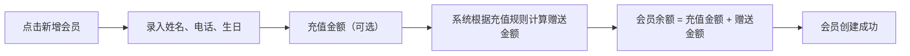
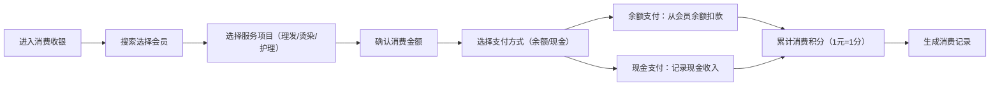

## 1. 产品概述

为小型理发店打造的轻量级会员管理与消费记录系统，解决日常经营中会员充值、消费扣款、积分管理、生日提醒和营业统计等核心需求。

- 目标用户：理发店老板/店长
- 核心价值：简化会员管理流程，提升客户服务体验，清晰掌握经营数据

## 2. 核心功能

### 2.1 功能模块

1. **首页仪表盘**：今日数据概览、近期生日会员提醒、快捷操作入口
2. **会员管理**：会员列表、新增会员、会员详情（余额、积分、消费记录）
3. **消费收银**：选择会员、选择服务项目、余额扣款、积分累计
4. **充值管理**：会员卡充值、充值赠送规则设置
5. **积分管理**：积分兑换规则设置、积分兑换操作
6. **统计报表**：今日/本周/本月的现金收入、会员卡充值、消费明细

### 2.2 页面详情

| 页面名称 | 模块名称 | 功能描述 |
|-----------|-------------|---------------------|
| 首页仪表盘 | 数据概览 | 显示今日营业额、今日充值、今日消费单量 |
| 首页仪表盘 | 生日提醒 | 显示未来7天内生日的会员列表 |
| 首页仪表盘 | 快捷操作 | 快速跳转至新增会员、消费收银、会员卡充值 |
| 会员管理 | 会员列表 | 展示所有会员，支持按姓名/电话搜索 |
| 会员管理 | 新增会员 | 录入姓名、电话、生日、初始余额 |
| 会员管理 | 会员详情 | 查看余额、积分、消费历史、充值历史 |
| 消费收银 | 选择会员 | 搜索并选择消费会员 |
| 消费收银 | 选择项目 | 选择服务项目（理发/烫染/护理等）及价格 |
| 消费收银 | 结算支付 | 从余额扣款，累加点数，支持现金支付 |
| 充值管理 | 会员卡充值 | 输入充值金额，自动计算赠送金额 |
| 充值管理 | 充值规则设置 | 设置充X送Y的规则，可配置多条 |
| 积分管理 | 兑换规则设置 | 设置积分兑换比例（如100积分抵10元） |
| 积分管理 | 积分兑换 | 为会员执行积分兑换操作 |
| 统计报表 | 营业统计 | 按今日/本周/本月展示现金收入、充值收入、消费明细 |

## 3. 核心流程

### 3.1 会员办卡流程

### 3.2 消费流程

### 3.3 充值流程

## 4. 用户界面设计

### 4.1 设计风格
- **主色调**：深棕色（#5D4037），传达温暖、专业、高端的理发店氛围
- **辅助色**：暖金色（#FFB74D），用于强调重要数据和按钮
- **中性色**：米白色背景（#FFF8E1），深灰文字（#3E2723）
- **按钮风格**：圆角矩形，微立体阴影，悬停有轻微上浮效果
- **字体**：标题使用 "Noto Serif SC" 衬线字体，正文使用 "Noto Sans SC" 无衬线字体
- **布局风格**：卡片式布局，顶部导航 + 侧边菜单 + 主内容区
- **图标风格**：使用线性图标，搭配暖色调

### 4.2 页面设计概述

| 页面名称 | 模块名称 | UI 元素 |
|-----------|-------------|-------------|
| 首页仪表盘 | 数据概览 | 大数字卡片展示关键指标，渐变背景，图标点缀 |
| 首页仪表盘 | 生日提醒 | 带蛋糕图标的卡片列表，显示倒计时天数 |
| 会员管理 | 会员列表 | 表格布局，头像+姓名+电话+余额+积分，斑马纹 |
| 消费收银 | 项目选择 | 网格布局的服务卡片，点击选中，金额实时计算 |
| 充值管理 | 规则设置 | 可编辑的规则列表，支持新增/删除规则 |
| 统计报表 | 数据图表 | 柱状图展示每日收入趋势，卡片展示汇总数据 |

### 4.3 响应式
- 桌面端优先设计（1280px+），主内容区宽度1200px
- 侧边栏在平板端可折叠，移动端转为底部Tab导航
- 表格在小屏幕下转为卡片列表展示
- 所有按钮和交互元素保证44px最小触控区域

