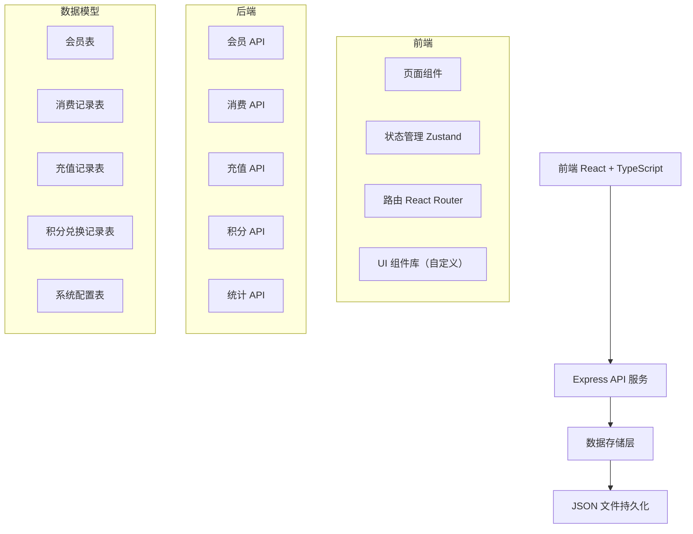
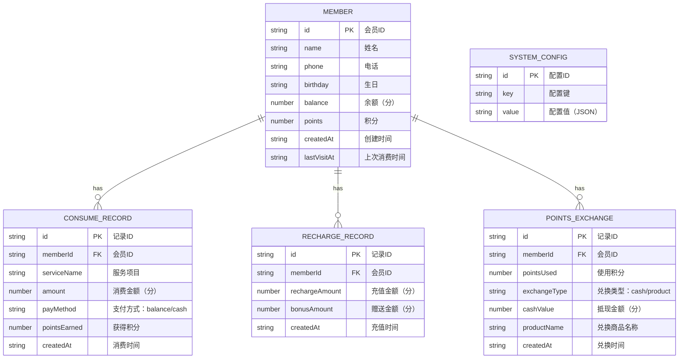

## 1. 架构设计



## 2. 技术描述

- **前端**：React@18 + TypeScript + Vite + TailwindCSS@3 + Zustand + React Router
- **后端**：Express@4 + TypeScript
- **初始化工具**：vite-init
- **数据存储**：JSON 文件持久化（小型应用，无需数据库）
- **图标库**：lucide-react
- **HTTP 客户端**：axios

## 3. 路由定义

### 前端路由

| 路由 | 页面 | 用途 |
|-------|---------|---------|
| / | Dashboard | 首页仪表盘，数据概览和生日提醒 |
| /members | MemberList | 会员列表页 |
| /members/new | MemberNew | 新增会员页 |
| /members/:id | MemberDetail | 会员详情页 |
| /checkout | Checkout | 消费收银页 |
| /recharge | Recharge | 会员卡充值页 |
| /recharge/rules | RechargeRules | 充值规则设置页 |
| /points | Points | 积分管理页 |
| /points/rules | PointsRules | 积分兑换规则设置页 |
| /statistics | Statistics | 统计报表页 |
| /settings | Settings | 系统设置页 |

### 后端 API 路由

| 方法 | 路由 | 用途 |
|-------|---------|---------|
| GET | /api/members | 获取会员列表 |
| GET | /api/members/:id | 获取会员详情 |
| POST | /api/members | 新增会员 |
| PUT | /api/members/:id | 更新会员信息 |
| GET | /api/members/:id/records | 获取会员消费/充值记录 |
| POST | /api/consume | 创建消费记录 |
| POST | /api/recharge | 创建充值记录 |
| GET | /api/records/consume | 获取消费记录列表 |
| GET | /api/records/recharge | 获取充值记录列表 |
| GET | /api/statistics/daily | 获取今日统计数据 |
| GET | /api/statistics/weekly | 获取本周统计数据 |
| GET | /api/statistics/monthly | 获取本月统计数据 |
| GET | /api/config/recharge-rules | 获取充值规则 |
| PUT | /api/config/recharge-rules | 更新充值规则 |
| GET | /api/config/points-rules | 获取积分规则 |
| PUT | /api/config/points-rules | 更新积分规则 |
| GET | /api/config/services | 获取服务项目列表 |
| PUT | /api/config/services | 更新服务项目列表 |
| POST | /api/points/exchange | 积分兑换 |

## 4. 数据模型

### 4.1 数据模型定义



### 4.2 系统配置说明

系统配置存储在 JSON 文件中，包含：

1. **充值规则** (`rechargeRules`)
```json
[
  { "minAmount": 30000, "bonusAmount": 5000 },
  { "minAmount": 50000, "bonusAmount": 10000 },
  { "minAmount": 100000, "bonusAmount": 30000 }
]
```

2. **积分规则** (`pointsRules`)
```json
{
  "pointsPerYuan": 1,
  "exchangeRate": 100,
  "minPoints": 100
}
```

3. **服务项目** (`services`)
```json
[
  { "id": "1", "name": "精剪", "price": 6800, "category": "haircut" },
  { "id": "2", "name": "烫染", "price": 39800, "category": "perm" },
  { "id": "3", "name": "护理", "price": 19800, "category": "treatment" }
]
```

4. **生日提醒配置** (`birthdayConfig`)
```json
{
  "remindDays": 7,
  "couponAmount": 5000
}
```

### 4.3 数据文件结构

```
data/
├── members.json           # 会员数据
├── consumeRecords.json    # 消费记录
├── rechargeRecords.json   # 充值记录
├── pointsExchange.json    # 积分兑换记录
└── config.json            # 系统配置
```

## 5. 前端状态管理

使用 Zustand 管理全局状态：

```typescript
interface AppState {
  members: Member[];
  currentMember: Member | null;
  config: SystemConfig;
  statistics: StatisticsData;
  loading: boolean;
  
  // Actions
  fetchMembers: () => void;
  fetchMember: (id: string) => void;
  addMember: (member: Omit<Member, 'id' | 'createdAt'>) => void;
  updateMember: (id: string, data: Partial<Member>) => void;
  consume: (data: ConsumeData) => void;
  recharge: (data: RechargeData) => void;
  fetchStatistics: (type: 'daily' | 'weekly' | 'monthly') => void;
  updateConfig: (key: string, value: any) => void;
}
```

## 6. 开发规范

- **代码风格**：使用 ESLint + Prettier
- **组件规范**：每个组件不超过 300 行，职责单一
- **目录结构**：
  ```
  src/
  ├── components/    # 可复用组件
  ├── pages/         # 页面组件
  ├── store/         # Zustand 状态管理
  ├── utils/         # 工具函数（日期、金额格式化等）
  ├── types/         # TypeScript 类型定义
  ├── api/           # API 调用封装
  └── hooks/         # 自定义 Hooks
  
  api/               # 后端 Express 代码
  ├── routes/        # API 路由
  ├── services/      # 业务逻辑
  ├── data/          # 数据文件
  └── utils/         # 后端工具函数
  ```

